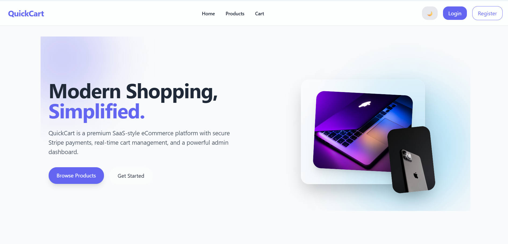
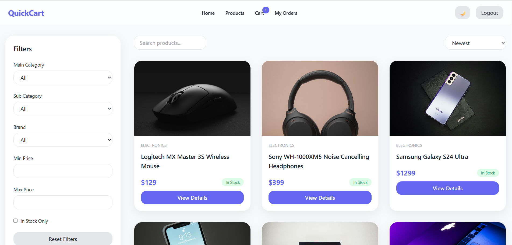
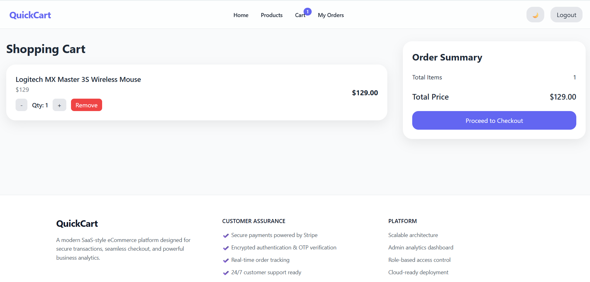
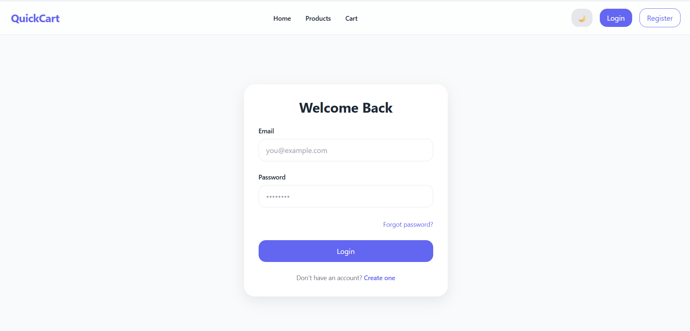
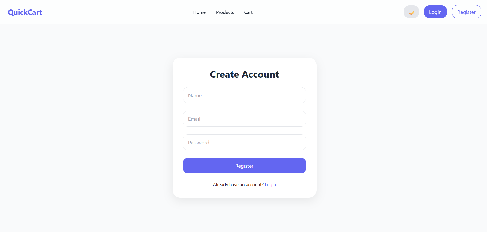
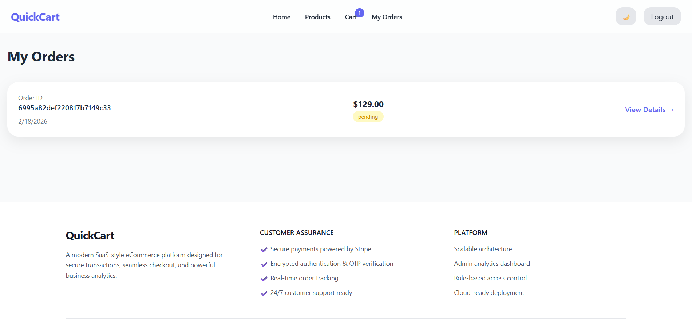

# 🛒 QuickCart – Full Stack E-Commerce Application

QuickCart is a modern full-stack e-commerce platform built using the MERN stack.
It includes authentication, product management, cart functionality, secure checkout, and order tracking.

---

## 🚀 Live Demo

🌐 Frontend: https://quickcart-fullstack.vercel.app/  
🔗 Backend API: https://quickcart-fullstack.onrender.com/

---

## ✨ Features

- 🔐 JWT Authentication
- 🛍 Product Listing & Filtering
- 🛒 Shopping Cart
- 💳 Stripe Payment Integration
- 📦 Order Management
- 📱 Fully Responsive Design

---

## 🛠 Tech Stack

### Frontend
- React (Vite)
- Tailwind CSS
- Axios

### Backend
- Node.js
- Express.js
- MongoDB
- Mongoose
- JWT Authentication
- Stripe API

---

## 📸 Screenshots

### 🏠 Home Page


### 🛍 Product Page


### 🛒 Cart Page


### 🔐 Login Page


### 📝 Register Page


### 📦 My Orders


---

## ⚙️ Installation

### Clone Repository

```
git clone https://github.com/MirAshique/quickcart-fullstack.git
```

### Backend Setup

```
cd Backend
npm install
npm run dev
```

### Frontend Setup

```
cd Frontend
npm install
npm run dev
```

---

## 👨‍💻 Author

Hussain – Full Stack MERN Developer  
📧 ashiqtalpur18@gmail.com